# MxR-malloc

A descriptor-based memory allocator for **ESP8266 RTOS SDK**, engineered as a drop-in replacement for the standard `heap_caps` allocator.

Instead of embedding linked-list metadata inside every allocated block, MxR keeps a compact, sorted **descriptor table** outside the heap. Combined with size-class **regions**, an optional **IRAM heap**, and a configurable **fallback chain**, this yields lower fragmentation, zero per-block overhead, and full `heap_caps_*` API compatibility through linker `--wrap`.

---

## Table of Contents

- [Why MxR-malloc](#why-mxr-malloc)
- [Memory Layout](#memory-layout)
- [The Descriptor Table](#the-descriptor-table)
- [Allocation Flow (`malloc`)](#allocation-flow-malloc)
- [Free Flow (`free`)](#free-flow-free)
- [Reallocation (`realloc`)](#reallocation-realloc)
- [IRAM Heap](#iram-heap)
- [Cross-Region Fallback](#cross-region-fallback)
- [Free-Block Search Strategies](#free-block-search-strategies)
- [Initialization](#initialization)
- [Configuration](#configuration)
- [Integration Methods](#integration-methods)
- [API Reference](#api-reference)
- [Diagnostics](#diagnostics)
- [Performance Characteristics](#performance-characteristics)
- [Limitations](#limitations)
- [Project Structure](#project-structure)
- [License](#license)

---

## Why MxR-malloc

The core is intentionally small: a sorted descriptor table, a handful of
region descriptors, and (optionally) a bitmap. All operations run under a
single ETS interrupt lock, which makes the allocator safe from both tasks and
ISRs.

---

## Memory Layout

MxR manages up to two physical arenas:

- **DRAM** — the main heap, from `_bss_end` up to `0x40000000` .
- **IRAM** — optional, from `_iram_end` up to `0x40100000 + CONFIG_SOC_IRAM_SIZE` .

### DRAM arena with regions

The DRAM arena is divided into **regions**, each serving a range of block
sizes (a size class). The last region is always unlimited and absorbs leftover
memory.

```
DRAM arena (example: 3 regions, 80 KB total)
┌──────────────────────────────────────────────────────────────────────┐
│  Region 0          │  Region 1           │  Region 2                │
│  small blocks      │  medium blocks      │  large / unlimited       │
│  4–132 B           │  132–1024 B         │  1024 B – unlimited      │
│  15% of arena      │  45% of arena       │  remaining (40%)         │
├────────────────────┼─────────────────────┼──────────────────────────┤
│ start_unit = 0     │ start_unit = 3000   │ start_unit = 12000       │
│ min_units = 1      │ min_units = 33      │ min_units = 256          │
│ max_units = 33     │ max_units = 256     │ max_units = 0 (unlimited)│
└──────────────────────────────────────────────────────────────────────┘
        ▲                     ▲                       ▲
        └─────────────────────┴───────────────────────┘
              Free blocks are found by scanning gaps
              between descriptors *within* each region.
```

Each region tracks its own free space, low-water mark, and allocation count,
so diagnostics can report exactly which size class is under pressure.

### IRAM arena

IRAM is a single flat region used for:

- `MALLOC_CAP_EXEC` allocations (executable code), and
- optional **fallback** for ordinary 32-bit allocations when DRAM is full.

```
IRAM arena
┌────────────────────────────────────────────────────┐
│  EXEC blocks (reserved)   │  32-bit fallback area  │
│  caps = 32BIT | EXEC      │  caps = 32BIT          │
└────────────────────────────────────────────────────┘
        ▲                            ▲
        │                            └─ only used if DRAM fails
        └─ CONFIG_MXR_IRAM_RESERVE_BYTES keeps this area free
```

---

## The Descriptor Table

Every active allocation is represented by a single **4-byte descriptor**.
Nothing is stored inside the allocated block itself.

### Descriptor format

```
 mxr_desc_t (4 bytes)
 ┌─────────────────────────────┬─────────────────────────────┐
 │        off_flags (16b)      │        len_flags (16b)      │
 ├───────────────┬─────────────┼───────────────┬─────────────┤
 │ bit 15        │ bits 14..0  │ bit 15        │ bits 14..0  │
 │ IRAM flag     │ offset      │ EXEC flag     │ length − 1  │
 │ 0=DRAM 1=IRAM │ in 4B units │ 1=executable  │ in 4B units │
 └───────────────┴─────────────┴───────────────┴─────────────┘
```

- **Offset** and **length** are measured in 4-byte units ( `MXR_UNIT_SIZE` ).
- Storing `length − 1` lets the field represent 1..32768 units (4 B..128 KB).
- The IRAM bit in `off_flags` separates the two arenas inside one table.
- The EXEC bit in `len_flags` marks executable IRAM blocks.

### Sorted order and binary search

The table is always sorted by `off_flags`. Because DRAM descriptors have the
IRAM bit cleared and IRAM descriptors have it set, **all DRAM descriptors come
first, all IRAM descriptors last**.

```
Descriptor table (sorted by off_flags)
┌────────┬────────┬────────┬────────┬────────┬────────┬────────┐
│ DRAM   │ DRAM   │ DRAM   │  ...   │ IRAM   │ IRAM   │ IRAM   │
│ off=0  │ off=40 │ off=96 │        │ off=8  │ off=64 │ off=200│
└────────┴────────┴────────┴────────┴────────┴────────┴────────┘
   ▲                                       ▲
   └── DRAM partition ──┘     IRAM partition ──┘
```

Lookup by offset is a binary search (`mxr_desc_find_key`). Insertion finds its
position with the same binary search, checks for overlaps with neighbours, and
shifts the tail. Removal shifts the tail left. With the default capacity of
256 descriptors these operations are cheap; the capacity is configurable up to
4096.

---

## Allocation Flow (`malloc`)

`mxr_malloc_caps(size, caps)` is the heart of the allocator.



### Step by step

1. **Validate and convert.** `size == 0` becomes 1. Sizes above 128 KB fail. The byte size is rounded up to 4-byte units.
2. **EXEC path.** If `caps` includes `MALLOC_CAP_EXEC` , the block must live in IRAM. MxR searches IRAM from the start and inserts an EXEC descriptor.
3. **DRAM size-class lookup.** Otherwise, `mxr_region_for_size` picks the region whose `[min_units, max_units]` range contains the block and whose capabilities match.
4. **Try the own region.** `mxr_try_alloc_region` searches for a contiguous gap (via descriptor scan or bitmap). On success a DRAM descriptor is inserted and the region's free counters are updated.
5. **Fallback chain.** If the own region cannot satisfy the request, MxR walks the configured fallback chain (see below).

### Fallback chain

The order is compile-time configurable. With both features enabled, the
default is **IRAM first, cross-region last**:


Setting `CONFIG_MXR_CROSS_REGION_AFTER_IRAM=n` swaps the last two stages so
IRAM stays untouched for EXEC allocations.

---

## Free Flow (`free`)



Free is the mirror of malloc:

1. Determine the arena from the pointer address.
2. Convert the pointer to a unit offset and binary-search the descriptor.
3. Remove the descriptor (the gap it occupied becomes free automatically).
4. Return the units to the region (DRAM) or the IRAM pool.
There is **no coalescing step**. Because free space is derived from gaps
between descriptors, removing a descriptor instantly merges its space with the
neighbouring gaps.

Pointers that do not fall inside a managed arena, or that have no matching
descriptor, are counted in `invalid_free_attempts` and ignored — a double free
or wild pointer will not corrupt the heap.

---

## Reallocation (`realloc`)

`mxr_realloc_caps` tries hard to resize **in place** before falling back to
allocate-copy-free.



### In-place rules (DRAM)

- **Same size** → return immediately.
- **Shrink** → shorten the descriptor and release the tail units.
- **Grow** → allowed only if the region still accepts the new size class, the capabilities still match, and the gap up to the next descriptor (or region end) is large enough.
If any condition fails, MxR allocates a fresh block, copies `min(old, new)`
units, and frees the original. The copy happens **outside the lock**; the
caller guarantees no concurrent access to `ptr` during `realloc`.

### In-place rules (IRAM)

- An existing **EXEC** block always stays EXEC.
- A non-EXEC fallback block can grow in place only while respecting the IRAM EXEC reserve ( `CONFIG_MXR_IRAM_RESERVE_BYTES` ) and the fallback size limit.
- Requesting EXEC on a non-EXEC block forces a move rather than silently converting the block.

---

## IRAM Heap

Enabled with `CONFIG_MXR_USE_IRAM` (on by default unless the SDK disables
IRAM). IRAM spans from `_iram_end` to the top of the IRAM window, subject to
the original SDK limits (512 B < size < 64 KB).

### Capability routing

| Requested caps | Destination |
| --- | --- |
| `EXEC` | IRAM only |
| `DMA`, `8BIT`, `SPIRAM` | DRAM only (never IRAM) |
| plain `32BIT` (or `0`) | DRAM first, IRAM as fallback |

### EXEC reserve

To keep executable memory available, non-EXEC fallback allocations must leave
`CONFIG_MXR_IRAM_RESERVE_BYTES` free. `CONFIG_MXR_IRAM_FALLBACK_MAX_BYTES`
can additionally cap the size of any single fallback block (`0` = unlimited).

```
IRAM free space accounting
┌──────────────────────────────────────────────┐
│ used │ free usable by fallback │  reserved  │
└──────────────────────────────────────────────┘
                                    ▲
                                    └─ kept free for EXEC allocations
```

---

## Cross-Region Fallback

A **last-resort** mechanism (`CONFIG_MXR_CROSS_REGION_FALLBACK`, off by
default). When a block's own size-class region is full and IRAM cannot help,
MxR may place the block in a *different* DRAM region, ignoring size classes.

Selection strategy:

1. Skip the block's own region.
2. Among regions with matching caps and enough free space, prefer the one whose `min_units` is closest to the requested size.
3. Optionally pre-check the largest contiguous free block ( `CONFIG_MXR_CROSS_REGION_CHECK_LARGEST` ) to skip fragmented regions.
4. If allocation fails due to fragmentation, try the next candidate.

> ⚠️ This intentionally fragments large-block regions with small allocations.
It exists to avoid allocation failure in edge cases, not for everyday use.

---

## Free-Block Search Strategies

MxR offers two compile-time strategies for finding a contiguous gap in DRAM.

### Descriptor gap search (default)

Walks the sorted DRAM descriptors and measures the gaps between them:

```
region: [ ........................................ ]
descs:      ████      ██████        ███
gaps:    ^^^^    ^^^^^^      ^^^^^^^^    ^^^^^^^^^
              └─ first gap ≥ requested units wins
```

No extra memory is used. Cost is `O(n)` in the number of active DRAM
descriptors, which is small in typical embedded workloads.

### Bitmap accelerated search

`CONFIG_MXR_SEARCH_BITMAP` carves a bitmap from the **end** of the arena at
init time — one bit per 4-byte unit (≈1/32 of the arena).

```
Bitmap (1 bit per unit), carved from arena tail
 bit: 0 1 2 3 4 5 6 7 ... 
      1 1 1 0 0 0 0 1 ...
      └─ used ─┘└─ free ─┘
```

Allocation uses word-at-a-time scanning with `__builtin_ctz` to skip whole
32-unit words, which is faster for large, busy heaps at the cost of the bitmap
memory. The bitmap is DRAM-only; IRAM always uses a descriptor scan.

---

## Initialization

`mxr_init()` runs once (directly or via the wrapped `heap_caps_init`).



Key points:

- The DRAM arena is bounded by the linker symbol `_bss_end` and `0x40000000` .
- In bitmap mode the bitmap is taken from the arena tail before regions are created, so regions only see usable units.
- Region configuration is parsed from Kconfig strings (boundaries + weights). If parsing fails, MxR falls back to a single flat region so the system still boots.

---

## Configuration

All options live under `idf.py menuconfig → Component config → MxR-malloc`.

### Presets

| Preset | Regions | Typical workload |
| --- | --- | --- |
| Custom | user-defined | manual configuration |
| Balanced | 3 | general purpose |
| Minimal | 2 | bare-metal, no WiFi |
| WiFi Station | 3 | LWIP client |
| WiFi AP | 4 | many clients |
| TLS / HTTPS | 4 | mbedtls |
| Audio / Streaming | 4 | ADPCM, I2S, TCP |
| HTTP Server | 4 | esp_http_server |
| Sensor / Low-power | 3 | sensor polling |
| Logging / Debug | 3 | heavy ESP_LOG usage |

Every preset drives `MXR_REGIONS`, `MXR_REGION_SIZES`, and
`MXR_REGION_PERCENTS` through the same parser.

### Custom configuration

```
Number of heap regions: 3
Lower block size boundaries (bytes): "4,132,1024"
Memory weights (%):                  "15,45,0"
```

- Boundaries are in bytes and converted to 4-byte units.
- Weights are percentages; the sum must be ≤ 100.
- A trailing weight of `0` means "take all remaining memory".

### Single region mode

Set `Number of heap regions = 1` (Custom). The allocator uses one flat DRAM
region spanning the whole arena; boundary and weight fields are hidden and
ignored. Internally this calls the same single-region setup used by the
init-time fallback.

### IRAM options

```
Enable IRAM heap (EXEC + 32BIT fallback)
Reserve IRAM bytes for EXEC allocations: 2048
Maximum block size for IRAM fallback:    0   (0 = unlimited)
```

### Fallback options

```
Enable cross-region DRAM fallback (last resort)
  Check largest free block before cross-region fallback
  Cross-region only after
```

### Search mode

```
Free block search mode:
  (*) Descriptor gap search
  ( ) Bitmap accelerated search
```

### IRAM hot path

```
Disable placing malloc/free hot path in IRAM
IRAM hot path scope:
  (*) Core (malloc/free only)
  ( ) Allocation family (malloc/free/calloc/zalloc/realloc)
```

Placing the hot path in IRAM keeps `malloc`/`free` callable while the flash
cache is disabled (during flash write/erase).

---

## Integration Methods

MxR ships three mutually exclusive integration layers. **Use only one.**

### 1. Linker `--wrap` (recommended)

`mxr_heap_wrap.c` + the wrap flags in `CMakeLists.txt`. The original heap
component stays in the build; calls are redirected at link time:

```
Application calls:     _heap_caps_malloc(...)
Linker redirects to:   __wrap__heap_caps_malloc(...)
Which calls:           mxr_malloc_caps(...)
```

Base wraps are always on; query / default-pool / esp-system / libc wraps are
optional via Kconfig.

### 2. Direct replacement

`mxr_heap_compat.c` defines the `heap_caps_*` symbols directly. Use this only
if the original heap component is **not** compiled.

### 3. Direct libc

`mxr_heap_port.c` defines `malloc`/`free`/etc. directly. Rarely needed; the
wrap approach is safer.

> ⚠️ Never compile `mxr_heap_compat.c` or `mxr_heap_port.c` together with the
wrap layer — they will conflict.

---

## API Reference

### Core

```c
void  mxr_init(void);
void *mxr_malloc(size_t size);
void  mxr_free(void *ptr);
void *mxr_calloc(size_t count, size_t size);
void *mxr_realloc(void *ptr, size_t size);
void *mxr_zalloc(size_t size);
```

### Capability-aware

```c
void *mxr_malloc_caps(size_t size, uint32_t caps);
void *mxr_calloc_caps(size_t count, size_t size, uint32_t caps);
void *mxr_realloc_caps(void *ptr, size_t newsize, uint32_t caps);
void *mxr_zalloc_caps(size_t size, uint32_t caps);
```

Capability flags match the SDK: `MALLOC_CAP_EXEC`, `MALLOC_CAP_32BIT`,
`MALLOC_CAP_8BIT`, `MALLOC_CAP_DMA`, `MALLOC_CAP_INTERNAL`,
`MALLOC_CAP_SPIRAM`.

### Diagnostics

```c
void   mxr_get_status(mxr_status_t *status);
bool   mxr_get_region_status(int region_index, mxr_region_status_t *status);
size_t mxr_get_free_size_caps(uint32_t caps);
size_t mxr_get_min_free_size_caps(uint32_t caps);
void   mxr_dump(void);
```

---

## Diagnostics

`mxr_dump()` prints global statistics, per-region status, IRAM state, and a
snapshot of every descriptor:

```
I mxr_malloc: init ok: base=0x3ffe8000 units=20000 bytes=80000
I mxr_malloc: MxR dump: initialized=1
I mxr_malloc: search mode: descriptor
I mxr_malloc: total=80000 free=79872 min_free=79872 largest=79872
I mxr_malloc: desc used=0/256 max_used=0
I mxr_malloc: exec_allocs=0 iram_fallback=0 cross_region=0 cross_skip_frag=0
I mxr_malloc: region 0: caps=0x0000080e start=0     total=3000  min=1   max=33  ...
I mxr_malloc: region 1: caps=0x0000080e start=3000  total=9000  min=33  max=256 ...
I mxr_malloc: region 2: caps=0x0000080e start=12000 total=8000  min=256 max=0   ...
```

`max=0` means unlimited. The counters `alloc_fail_no_memory`,
`alloc_fail_table_full`, and `invalid_free_attempts` help diagnose exhaustion
and misuse.

---

## Performance Characteristics

- **malloc / free hot path** can reside in IRAM, safe during flash operations.
- **Free-block search** is `O(n)` over descriptors (gap scan) or word-parallel (bitmap). Both are fast for typical descriptor counts.
- **Descriptor insert/remove** is `O(n)` due to the array shift, bounded by `CONFIG_MXR_MAX_DESC` .
- **No coalescing pass** is ever needed — merging is implicit.
- **Size-class regions** keep small blocks from fragmenting large-block space, reducing worst-case fragmentation in long-running devices.

---

## Limitations

- Maximum arena size: **128 KB** (32768 × 4-byte units).
- Maximum single allocation: **128 KB** .
- Maximum simultaneous allocations: configurable, default **256** , up to 4096.
- Not compatible with `CONFIG_HEAP_TRACING` (a build warning is emitted).
- IRAM fallback is unavailable for `DMA` , `8BIT` , or `SPIRAM` capabilities.
- Cross-region fallback, if enabled, can fragment large-block regions.

---

## Project Structure

```
mxr_malloc/
├── include/
│   └── mxr_malloc.h          # Public API, descriptor helpers, types
├── mxr_malloc.c              # Core allocator
├── mxr_heap_wrap.c           # Linker --wrap layer (recommended)
├── mxr_heap_compat.c         # Direct heap_caps replacement (alternative)
├── mxr_heap_port.c           # Direct libc replacement (alternative)
├── CMakeLists.txt            # Build config and --wrap flags
└── Kconfig.projbuild         # Menuconfig options and presets
```

---

## License

Provided as-is for use with the ESP8266 RTOS SDK.
